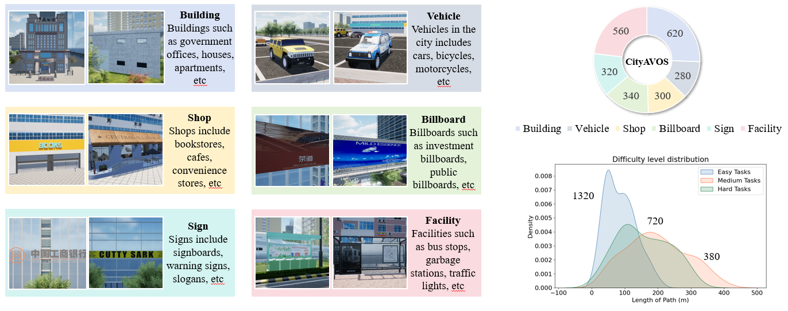

# Towards Autonomous UAV Visual Object Search in City Space: Benchmark and Agentic Methodology

  

## Introdution
Aerial Visual Object Search (AVOS) tasks in urban environments require Unmanned Aerial Vehicles (UAVs) to autonomously search for and identify target objects using visual and textual cues without external guidance. Existing approaches struggle in complex urban environments due to redundant semantic processing, similar object distinction, and the exploration-exploitation dilemma. To bridge this gap and support the AVOS task, we introduce CityAVOS, the first benchmark dataset for autonomous search of common urban objects. This dataset comprises 2,420 tasks across six object categories with varying difficulty levels, enabling comprehensive evaluation of UAV agents' search capabilities. To solve the AVOS tasks, we also propose \textbf{PRPSearcher} (\textbf{P}erception-\textbf{R}easoning-\textbf{P}lanning \textbf{Searcher}), a novel agentic method powered by multi-modal large language models (MLLMs) that mimics human three-tier cognition. Specifically, PRPSearcher constructs three specialized maps: an object-centric dynamic semantic map enhancing spatial perception, a 3D cognitive map based on semantic attraction values for target reasoning, and a 3D uncertainty map for balanced exploration-exploitation search. Also, our approach incorporates a denoising mechanism to mitigate interference from similar objects and utilizes an Inspiration Promote Thought (IPT) prompting mechanism for adaptive action planning. 
Experimental results on CityAVOS demonstrate that PRPSearcher surpasses existing baselines in both success rate and search efficiency (on average: +37.69\% SR, +28.96\% SPL, -30.69\% MSS, and -46.40\% NE). While promising, the performance gap compared to humans highlights the need for better semantic reasoning and spatial exploration capabilities in AVOS tasks. This work establishes a foundation for future advances in embodied target search.

### CityAVOS dataset

  

### Overview of the PRPSearcher agent

  

### The installation and usage instructions for our code will be updated shortly.

